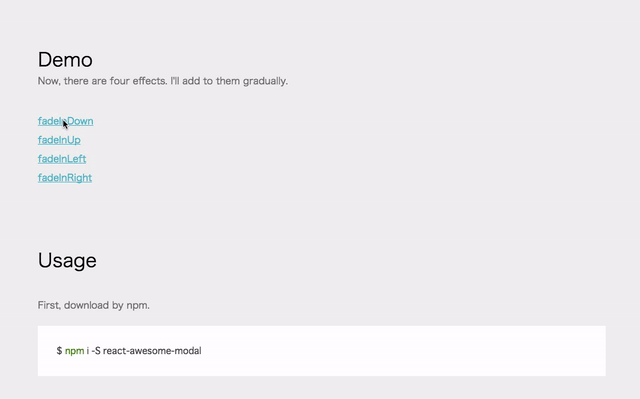

# react-awesome-modal
[](https://travis-ci.org/shibe97/react-awesome-modal)

This is a Customizable Modal.

[http://shibe97.github.io/react-awesome-modal/](http://shibe97.github.io/react-awesome-modal/)



## Usage
```javascript
import React, { Component } from 'react';
import Modal from 'react-awesome-modal';

export default class Examples extends Component {
    constructor(props) {
        super(props);
        this.state = {
            visible : false
        }
    }

    openModal() {
        this.setState({
            visible : true
        });
    }

    closeModal() {
        this.setState({
            visible : false
        });
    }

    render() {
        return (
            <section>
                <h1>React-Modal Examples</h1>
                <input type="button" value="Open" onClick={() => this.openModal()} />
                <Modal visible={this.state.visible} width="400" height="300" effect="fadeInUp" onClickAway={() => this.closeModal()}>
                    <div>
                        <h1>Title</h1>
                        <p>Some Contents</p>
                        <a href="javascript:void(0);" onClick={() => this.closeModal()}>Close</a>
                    </div>
                </Modal>
            </section>
        );
    }
}
```

## Props
| Attribute   | Required | Type     | description                                 | example                      |
|:------------|:---------|:---------|:--------------------------------------------|:-----------------------------|
| visible     | required | Boolean  | to show or hide the dialog                  | false                        |
| effect      | option   | String   | to set how to pop-up                        | fadeInUp, fadeInDown, etc... |
| width       | option   | String   | to set modal width (px or %)                | 500, 500px, 80%              |
| height      | option   | String   | to set modal height (px or %)               | 400, 400px, 50%              |
| onClickAway | option   | Function | to set actions when the user click the mask | -                            |

## Effect
- fadeInDown [default]
- fadeInUp
- fadeInLeft
- fadeInRight

## How To Develop
### Setup
```
$ npm install
```

### Build
```
$ npm run build
```

### Watch and auto build
```
$ npm run watch
```

### Test
```
$ npm test
```

### Docs
```
$ npm run docs
```

## License
MIT
